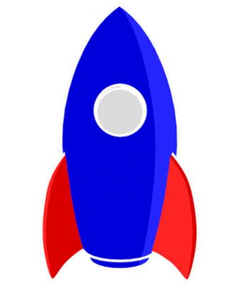

<p align="center">
  
   
</p>
<h1 align="center">Hi </img>, I'm Le Ha Gia Bao</h1>
<h2 align="center"> Write code. Blow minds </h2>

##  About Me:
-  I'm currently 2rd year student at **[University of Information Technology - Vietnam National University (UIT - VNU-HCM)](https://www.uit.edu.vn/)** 
-  My major is **E-Commerce**
-  I'm working as a Front-end Developer at **<a href="https://www.facebook.com/webdevstudios.org"> Webdev Studios </a>**
-  I'm focus on learning **Web and Mobile Development**
-  In my free time, I pursue **UI/UX Design**
-  I have basic knowledge in **```Web Development``` `Object-Oriented Programming` ```Data Structures and Algorithms```**
-  My quote is ***"A million dreams are keeping me awake"*** 

##  Some Languages and Tools
### 👉 Programming languages
    

### 👉 Front-End
          

### 👉 Database


### 👉 Version Control & Hosting
     

### 👉 Package Manager
 

### 👉 IDEs/Editors 
    

### 👉 Design
           

### 👉 Tools
         

### 👉 Forums
   	    

### 👉 Educations
      

##  About Some Stats
<div align="center">


</div>
<div align="center">

</div>

##  For More Information, Please Check Out or Connect Me Via
<div align="center">
  
  <a href="mailto:lehagiabao0205@gmail.com" ></a>
  <a href="https://github.com/LeHaGiaBao" ></a>
  <a href="https://gitlab.com/LeHaGiaBao" ></a>
  <a href="https://linkedin.com/in/lehagiabao" target="_blank"></a>
  <a href="https://www.facebook.com/lehagiabao0205/" target="_blank"></a>
  <a href="https://www.instagram.com/le.ha.gia.bao/" target="_blank"></a>
  <a href="https://twitter.com/lehagiabao" target="_blank"></a>
  
</div> 


<div align="center">
  <h3>
  🥰 Thanks for watching my profile! Have a nice day! 😘 <br/>
  &copy; 2022 Le Ha Gia Bao
  </h3>
  
  
</div>
